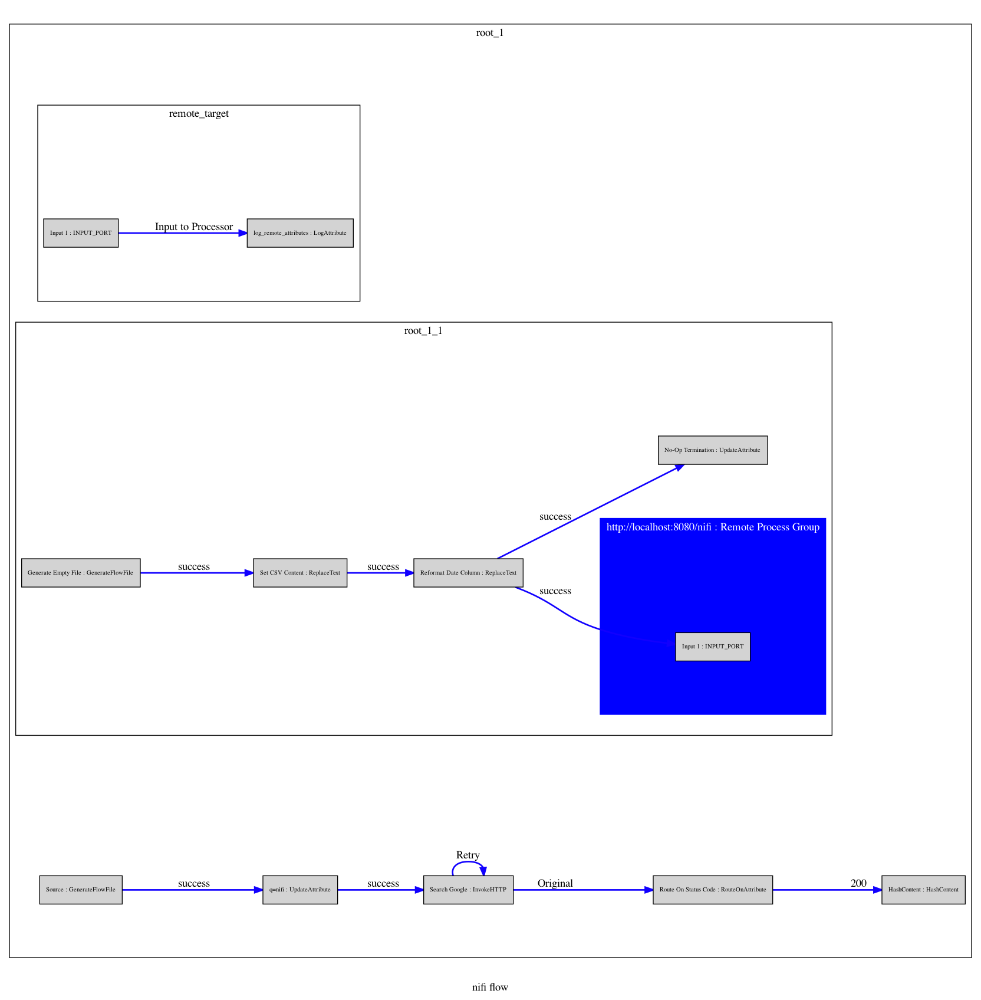

# dotifi


A utility to generate [DOT](https://graphviz.org/doc/info/lang.html) files and images based on [graphviz](https://graphviz.org/documentation/) from the canvas of an [Apache NiFi](https://nifi.apache.org) instance.

dotifi supports
- connecting to Apache Nifi using [nipyapi](https://nipyapi.readthedocs.io/en/latest/index.html) in the background and generating a graph from the canvas items
    - Process Groups
    - Remote Process Groups
    - Input and Output Ports
    - Processors
    - Connections
- creating [DOT]() files using [Graphviz](https://graphviz.org) and [pygraphviz](http://pygraphviz.github.io/documentation/pygraphviz-1.5/index.html)
- creating a graphic file in Graphviz supported formats
- starting with an existing dot file as opposed to building from a live NiFi instance
- starting from a specific process group
- controlling the depth of recursion
- supplying DOT files as templates for configuring
    - the root graph ( and all children)
    - Any process group by ID
- supplying name value pairs ( in yaml configuration file) to override and set [attributes](https://graphviz.gitlab.io/_pages/doc/info/attrs.html)
    - Processors by id
    - Remote Process Groups by id

## Install

```bash
>pip install dotifi
```
> with python 3 as your default
>
### Sample output

`DOT`
```
strict digraph "nifi flow" {
	graph [compound=true,
		label="nifi flow",
		outputorder=edgesfirst,
		rankdir=LR,
		ratio=1.0
	];
	node [fixedsize=false,
		fontsize=8,
		label="\N",
		shape=rectangle,
		style=filled
	];
	edge [color="#1100FF",
		style="setlinewidth(2)"
	];
	subgraph cluster_root_1 {
		graph [label=root_1];
		subgraph cluster_remote_target {
			graph [label=remote_target];
			"65f5b8db-0172-1000-407f-93e85d1d9f94"	[label="Input 1
INPUT_PORT",
				pos="-768.000000,-768.000000"];
			"65f629b8-0172-1000-4ced-efa192c35536"	[label="log_remote_attributes
LogAttribute",
				pos="-344.000000,-344.000000"];
			"65f5b8db-0172-1000-407f-93e85d1d9f94" -> "65f629b8-0172-1000-4ced-efa192c35536"	[label="Input to Processor"];
		}
		subgraph cluster_root_1_1 {
			graph [label=root_1_1];
			subgraph "cluster_NiFi Flow" {
				graph [color=blue,
					fontcolor=white,
					label="http://localhost:8080/nifi
Remote Process Group",
					style=filled
				];
				"37b065f7-232b-30b9-a282-3ea28f75a2a2"	[label="Input 1
INPUT_PORT"];
			}
			"b268f335-2a91-44e8-b567-c676c292fd55"	[label="Reformat Date Column
ReplaceText",
				pos="1259.009165,1259.009165"];
			"25b139c3-db89-4272-59c3-774ce58f0973"	[label="No-Op Termination
UpdateAttribute",
				pos="1265.009165,1265.009165"];
			"b268f335-2a91-44e8-b567-c676c292fd55" -> "25b139c3-db89-4272-59c3-774ce58f0973"	[label=success];
			"b268f335-2a91-44e8-b567-c676c292fd55" -> "37b065f7-232b-30b9-a282-3ea28f75a2a2"	[label=success];
			"67626c71-910a-4342-627d-e38cfcbcb924"	[label="Set CSV Content
ReplaceText",
				pos="408.000000,408.000000"];
			"67626c71-910a-4342-627d-e38cfcbcb924" -> "b268f335-2a91-44e8-b567-c676c292fd55"	[label=success];
			"bc3ad300-c93c-430b-fc94-3a32c3020f53"	[label="Generate Empty File
GenerateFlowFile",
				pos="356.009165,356.009165"];
			"bc3ad300-c93c-430b-fc94-3a32c3020f53" -> "67626c71-910a-4342-627d-e38cfcbcb924"	[label=success];
		}
		"719d5fb9-cd96-4491-fe7c-e81b3f3bb555"	[label="q=nifi
UpdateAttribute",
			pos="1242.304169,1242.304169"];
		"e829b880-ef17-432a-7c5c-1e3ecdcd690d"	[label="Search Google
InvokeHTTP",
			pos="1245.295837,1245.295837"];
		"719d5fb9-cd96-4491-fe7c-e81b3f3bb555" -> "e829b880-ef17-432a-7c5c-1e3ecdcd690d"	[label=success];
		"f96be8b1-78b2-42f2-6ba5-2579f4f6c411"	[label="Source
GenerateFlowFile",
			pos="425.000000,425.000000"];
		"f96be8b1-78b2-42f2-6ba5-2579f4f6c411" -> "719d5fb9-cd96-4491-fe7c-e81b3f3bb555"	[label=success];
		"83ca901a-efe0-4d97-dbca-5c557cefbe6f"	[label="HashContent
HashContent",
			pos="1264.422387,1264.422387"];
		"ffcc8819-75f5-4811-e906-434e71a31f26"	[label="Route On Status Code
RouteOnAttribute",
			pos="1242.078949,1242.078949"];
		"ffcc8819-75f5-4811-e906-434e71a31f26" -> "83ca901a-efe0-4d97-dbca-5c557cefbe6f"	[label=200];
		"e829b880-ef17-432a-7c5c-1e3ecdcd690d" -> "ffcc8819-75f5-4811-e906-434e71a31f26"	[label=Original];
		"e829b880-ef17-432a-7c5c-1e3ecdcd690d" -> "e829b880-ef17-432a-7c5c-1e3ecdcd690d"	[label=Retry];
	}
}

```
`PNG`

### poetry

dotifi is maintained using [poetry](https://python-poetry.org/docs/) for dependency management and packaging.

### Getting started for development
- Install [Graphviz](https://graphviz.org)
- Clone, fork, or download the [source](https://github.com/palindromicity/dotifi)
- Install [poetry](https://python-poetry.org/docs/)
- If required setup [pyenv](https://github.com/pyenv/pyenv) or your preference to get a python 3.8 environment, as poetry will use whatever the current python is.
    - for example setup pyenv local to the project directory
- In the source route directory run `poetry install`, this will install all the dependencies
- Run `peotry run pytest -v` to run the tests and ensure things are working
- Run `poetry build` then `poetry install` then `poetry run dotifi` with any options to run

#### Setting up [Jetbrains PyCharm](https://www.jetbrains.com/pycharm/) with your virtual python environment
- see [this reddit answer](https://www.reddit.com/r/pycharm/comments/elga2z/using_pycharm_for_poetrybased_projects/fn1ix60?utm_source=share&utm_medium=web2x)

## Configuration
dotifi uses [confuse](https://confuse.readthedocs.io/en/latest/) for it's configuration management.
dotifi will take most of its configuration:

 - from commandline parameters
 - from a yaml configuration file specified with the --with-conf-file parameter
 - some combination of the two

If a configuration file _is_ present, and some configuration value is set both from the commandline and in the configuration,
then the commandline is treated as an override for the configuration file.

String values in the configuration file may be entered as shell environment variables, such as $PATH.  Variables are expanded using
[os.path.expandvars](https://docs.python.org/3/library/os.path.html#os.path.expandvars).


```bash
usage: dotifi.py [-h] [--with-existing-dot-file WITH_EXISTING_DOT_FILE]
                 [--with-conf-file WITH_CONF_FILE]
                 [--output-dot-file OUTPUT_DOT_FILE]
                 [--output-graphviz-format {canon,cmap,cmapx,cmapx_np,dia,dot,fig,gd,gd2,gif,hpgl,imap,imap_np,ismap,jpe,jpeg,jpg,mif,mp,pcl,pdf,pic,plain,plain-ext,png,ps,ps2,svg,svgz,vml,vmlz,vrml,vtx,wbmp,xdot,xlib}]
                 [--output-graphviz-program {neato,dot,twopi,circo,fdp,nop}]
                 [--output-graphviz-file OUTPUT_GRAPHVIZ_FILE]
                 [--start-at-pg START_AT_PG] [--depth DEPTH]
                 [--nifi-url NIFI_URL] [--using-ssl USING_SSL]
                 [--using-user-pw USING_USER_PW] [--ca-file CA_FILE]
                 [--client-cert-file CLIENT_CERT_FILE]
                 [--client-key-file CLIENT_KEY_FILE]
                 [--client-key-password CLIENT_KEY_PASSWORD]
                 [--nifi-username NIFI_USERNAME]
                 [--nifi-user-password NIFI_USER_PASSWORD] [--verbose]
                 [--generate-mock-data] [--mock-data-file MOCK_DATA_FILE]

optional arguments:
  -h, --help            show this help message and exit
  --with-existing-dot-file WITH_EXISTING_DOT_FILE, -w WITH_EXISTING_DOT_FILE
                        Output will be based on an existing DOT graph
                        definition as opposed to being built from NiFi
  --with-conf-file WITH_CONF_FILE, -c WITH_CONF_FILE
                        Path to the .yaml file with the configuration. All
                        options can be set in the configuration, with
  --output-dot-file OUTPUT_DOT_FILE, -o OUTPUT_DOT_FILE
                        Path to the dot file to store the dot results to.
  --output-graphviz-format {canon,cmap,cmapx,cmapx_np,dia,dot,fig,gd,gd2,gif,hpgl,imap,imap_np,ismap,jpe,jpeg,jpg,mif,mp,pcl,pdf,pic,plain,plain-ext,png,ps,ps2,svg,svgz,vml,vmlz,vrml,vtx,wbmp,xdot,xlib}, -f {canon,cmap,cmapx,cmapx_np,dia,dot,fig,gd,gd2,gif,hpgl,imap,imap_np,ismap,jpe,jpeg,jpg,mif,mp,pcl,pdf,pic,plain,plain-ext,png,ps,ps2,svg,svgz,vml,vmlz,vrml,vtx,wbmp,xdot,xlib}
                        The format of the graphviz generated file. Formats
                        (not all may be available on every system depending on
                        how Graphviz was built)
  --output-graphviz-program {neato,dot,twopi,circo,fdp,nop}
                        Graphviz layout method to use.
  --output-graphviz-file OUTPUT_GRAPHVIZ_FILE, -g OUTPUT_GRAPHVIZ_FILE
                        Path to the dot file to store the graphviz results to.
                        Results will be saved with the extension of the
                        --output-graphviz-format option
  --start-at-pg START_AT_PG, -s START_AT_PG
                        The id of the process group to start at. This will be
                        a uuid. When set the output will start with this
                        process and it's descendents based on the depth
                        setting
  --depth DEPTH, -d DEPTH
                        The depth to descend to within nested process groups.
                        Note that the top level canvas is the root process
                        group. As such a depth of 0 will only output items in
                        the root canvas and not any process groups it
                        contains. A value of -1 means unlimited.
  --nifi-url NIFI_URL, -n NIFI_URL
                        The url of the NiFi instance to connect to. This is
                        used if --with-existing is not set.
  --using-ssl USING_SSL
                        Flag, when specified it signals that the NiFi
                        connection requires SSL
  --using-user-pw USING_USER_PW
                        Flag, when specified it signals that the NiFi
                        connection requires a username and password
  --ca-file CA_FILE     A PEM file containing certs for the root CA(s) for the
                        NiFi server
  --client-cert-file CLIENT_CERT_FILE
                        A PEM file containing the public certificates for the
                        user / client identity
  --client-key-file CLIENT_KEY_FILE
                        An encrypted (password -protected PEM file containing
                        the client's secret key
  --client-key-password CLIENT_KEY_PASSWORD
                        The password to decrypt the client_key_file
  --nifi-username NIFI_USERNAME
                        The NiFi user name
  --nifi-user-password NIFI_USER_PASSWORD
                        The NiFi user password
  --verbose, -v         Sets the logging level to verbose
  --generate-mock-data  Generates mock data
  --mock-data-file MOCK_DATA_FILE
                        When --generate-mock-data is specified, it will be
                        written to this file

```

A sample of the yaml configuration is [here](configurations/sample.yaml)

```yaml
# All string values in this configuration may be replaced using
# environmental variables in the form of $VARIABLENAME
#

#  Flag to set logging to verbose ( debugging level )
verbose:
#  Path to an existing DOT graph definition as opposed to being built from NiFi
with_existing_dot_file:
# Path to the dot file to store the dot results to
output_dot_file:

#  The format of the graphviz generated file. Formats (not all may be available on every system
#  depending on how Graphviz was built
#  "canon", "cmap", "cmapx", "cmapx_np", "dia", "dot", "fig", "gd", "gd2", "gif",
#  "hpgl", "imap", "imap_np", "ismap", "jpe", "jpeg", "jpg", "mif", "mp", "pcl", "pdf",
#  "pic", "plain", "plain_ext", "png", "ps", "ps2", "svg", "svgz", "vml", "vmlz", "vrml",
#  "vtx", "wbmp", "xdot", "xlib"
output_graphviz_format:

#  The Graphviz layout to use
# ‘neato’|’dot’|’twopi’|’circo’|’fdp’|’nop'
output_graphviz_program:

#  Path to the dot file to store the graphviz results to. Results will be saved with the extension
#  output_graphviz_format option
output_graphviz_file:

#  The id of the process group to start at.  This will be a uuid.  When set the output will start
#  with this process and it's decedents based on the depth setting
start_at_pg:

#  The depth to descend to within nested process groups.  Note that the top level canvas
#  is the root process group.  As such a depth of 0 will only output items in the root canvas and
#  not any process groups it contains.  A value of _1 means unlimited
depth:

# The url of the nifi instance to connect to.  This is used if with_existing is not set
nifi_url:

# Flag, when specified it signals that the NiFi connection requires SSL
using_ssl:

# Flag, when specified it signals that the NiFi connection requires a username and password
using_user_pw:

# A PEM file containing certs for the root CA(s) for the NiFi serve
ca_file:

# A PEM file containing the public certificates for the user / client identity
client_cert_file:

# An encrypted (password _protected PEM file containing the client's secret key
client_key_file:

# The password to decrypt the client_key_file
client_key_password:

# The NiFi user name
nifi_user_name:

# The NiFi user password
nifi_user_password:

# Options for the entire graph
graph:
    # Path to a dot file that contains top level graph definition that sets the properties
    # and attributes at a graph level
    # see https://graphviz.org/documentation/ for information on the dot language
    template: bar.dot
# Options for specific process groups, by id
process_groups:
    # the uuid id of the process group
    351b1dbc-0172-1000-056d-ec78a003b493:
        # Path to a dot file the contains the graph definition that sets the properties
        # and attributes at a graph level for this process group and it's descendents
        template: foo.dot
# Options for specific remote process groups, by id
# these values will override or mix in with the defaults
remote_process_groups:
    # the uuid of the remote process group
    35199793-0172-1000-02ea-52da1888a03d:
        # NODE attributes
        # see https://graphviz.gitlab.io/_pages/doc/info/attrs.html
        color: grey
# Options for specific processors, by id
processors:
    # the uuid of the processor
    351b1dbc-0172-1000-056d-ec78a003b49:
        # NODE attributes
        # see https://graphviz.gitlab.io/_pages/doc/info/attrs.html
        color: blue
```
